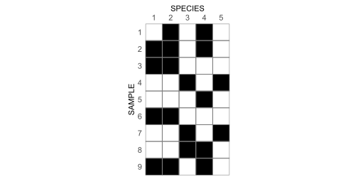
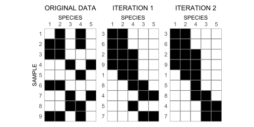
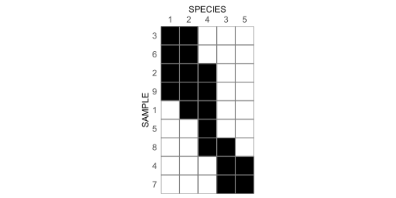

## Brower and Kile 1988

> Brower and Kile (1988). Seriation of an original data matrix as
> applied to paleoecology. *Lethaia* 21 (1).

R code that implements the seriation algorithm proposed by [Brower and
Kile
(1988)](https://www.idunn.no/doi/full/10.1111/j.1502-3931.1988.tb01756.x).
The method assumes a Boolean $n$ x $m$ matrix with $n$ samples and $m$
species. A value of one denotes the presence of the species $j$ at
sample $i$, zero the absence of $j$ at $i$.

Here is an example matrix based on their Fig 1.

``` r
M <- matrix(
  c(
    0, 1, 0, 1, 0,
    1, 1, 0, 1, 0,
    1, 1, 0, 0, 0,
    0, 0, 1, 0, 1,
    0, 0, 0, 1, 0,
    1, 1, 0, 0, 0,
    0, 0, 1, 0, 1,
    0, 0, 1, 1, 0,
    1, 1, 0, 1, 0
  ), 
  nrow = 9, 
  byrow = TRUE
)

colnames(M) <- 1:5
rownames(M) <- 1:9
```

And here is a simple function to visualize the matrix as in Fig. 1:

``` r
library(ggplot2)

mplot <- function(x, ...){
  
  d <- data.frame(
    x = rep(1:ncol(x), each = nrow(x)),
    y = rep(nrow(x):1, ncol(x)),
    z = as.integer(x)
  )

  ggplot(d, aes(x, y, fill = factor(z))) +
    geom_tile(col = "grey50", linewidth = 0.5) +
    scale_fill_manual(values = c("0" = "white", "1" = "black")) +
    coord_equal(expand = FALSE) +
    labs(
      x = "SPECIES",
      y = "SAMPLE"
    ) +
    scale_x_continuous(
      breaks = 1:ncol(x), 
      labels = colnames(x),
      position = "top"
    ) +
    scale_y_continuous(
      breaks = 1:nrow(x), 
      labels = rev(rownames(x))
    ) +
    theme(
      axis.text = element_text(size = rel(1)),
      axis.ticks = element_blank(),
      legend.position = "none",
      plot.title = element_text(hjust = 0.5)
    )
  
}

mplot(M)
```



### The Algorithm

The authors give a pretty straightforward description of the algorithm,
which they associate with the “concentration principle”:

> An *iteration*. - The computations are done in a series of iterations,
> each including four steps (Wilkinson 1974).
>
> \(1\) Calculate the mean position of the presences in the rows or
> samples of the data matrix. This is accomplished by averaging all
> column numbers which contain presences within that row. For this
> purpose the column numbers increase from left to right.
>
> \(2\) Arrange the rows of the data matrix into order according to
> these means. The sample numbers must also be sorted.
>
> \(3\) The mean position of the presences is determined for each column
> (taxon or species) of the data matrix. In other words, average the row
> numbers which have presences for each column. The row numbers increase
> from top to bottom of the matrix.
>
> \(4\) The column numbers of the data matrix are sorted according to
> these means. The vector of species numbers is also sorted.
>
> Iterations continue until the data stabilize.

Here is an R function that implements (1) through (4). I refer to this
as `increase_focus()` because one iteration is not guaranteed to reach
full concentration.

``` r
increase_focus <- function(x){
  
  # step 1: calculate mean column position (mcp) of presences across rows
  mcp <- apply(
    x, 
    MARGIN = 1, 
    FUN = \(z){ mean(which(z == 1)) }, 
    simplify = FALSE
  ) |> unlist()
  
  # step 2: sort rows by mcp
  names(mcp) <- 1:length(mcp)
  
  i <- as.integer(names(sort(mcp)))
  
  x <- x[i, ]
  
  # step 3: calculate mean row position (mrp) of presences across columns
  mrp <- apply(
    x, 
    MARGIN = 2, 
    FUN = \(z){ mean(which(z == 1)) }, 
    simplify = FALSE
  ) |> unlist()
  
  # step 4: sort columns by mrp
  names(mrp) <- 1:length(mrp)
  
  j <- as.integer(names(sort(mrp)))
  
  x[, j]
  
}
```

With this, we can re-create their Fig. 1.

``` r
library(patchwork)

og <- mplot(M) + 
  ggtitle("ORIGINAL DATA")

i1 <- mplot(increase_focus(M)) +
  ggtitle("ITERATION 1") +
  theme(axis.title.y = element_blank())

i2 <- mplot(increase_focus(increase_focus(M))) + 
  ggtitle("ITERATION 2") +
  theme(axis.title.y = element_blank())

og + i1 + i2
```



To test whether the matrix has stabilized, we simply drop
`increase_focus()` into a while-loop and test at each iteration whether
the new matrix is similar to the old one.

``` r
concentrate <- function(x){
  
  old <- x
  
  not_identical <- TRUE
  
  while(not_identical){
    
    new <- increase_focus(old)
    
    not_identical <- !identical(old, new)
    
    old <- new
    
  }
  
  new
  
}
```

And the result:

``` r
M |> concentrate() |> mplot()
```


